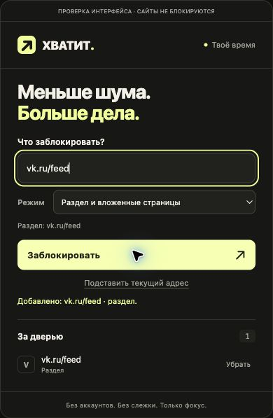

# Хватит 🖕

Расширение Google Chrome для блокировки отвлекающих сайтов, разделов и отдельных страниц. Вместо заблокированной страницы появятся 🖕 и надпись «хватит заниматься хуйней».


## Установка

1. Скачай репозиторий через **Code → Download ZIP** и распакуй архив в постоянную папку. Можно также клонировать репозиторий.
2. Открой в Chrome `chrome://extensions`.
3. Включи **Режим разработчика**.
4. Нажми **Загрузить распакованное расширение** и выбери папку, в которой лежит `manifest.json`.
5. Закрепи **Хватит** в меню расширений Chrome (значок пазла).

Сборка и установка зависимостей не нужны. Не перемещай папку после установки: Chrome загружает файлы расширения из неё. После обновления файлов нажми ↻ на карточке расширения в `chrome://extensions`.

[Официальная инструкция Chrome](https://developer.chrome.com/docs/extensions/get-started/tutorial/hello-world#load-unpacked).

## Использование



- Открой popup расширения, вставь ссылку или домен, выбери режим и нажми **Заблокировать** либо Enter.
- Кнопка **Подставить текущий адрес** заполняет поле: можно проверить адрес и режим перед добавлением.
- Уже открытые вкладки, подходящие под правило, перенаправляются на страницу блокировки.
- Кнопка **Убрать** удаляет правило. После этого открой сайт заново.
- Правила хранятся локально в Chrome и сохраняются после перезапуска браузера.

| Режим | Пример | Результат |
| --- | --- | --- |
| Весь сайт | `example.com` | Все страницы домена и его поддоменов |
| Раздел и вложенные страницы | `example.com/feed` | `/feed`, `/feed/` и `/feed/post/123`; `/music` и `/feedback` доступны |
| Точная страница | `example.com/article` | Только `/article`, без вложенных страниц и без `/article/` |
| Точная страница с параметрами | `youtube.com/watch?v=123` | Только `/watch` с указанной строкой параметров; другие видео доступны |

По умолчанию выбран режим **Автоматически по адресу**: домен без пути → весь сайт; путь → раздел; ссылка с параметрами `?…` или фрагментом `#…` → точная страница. Можно вручную выбрать любой режим для любой ссылки. Это универсальные правила по адресу, без настроек для конкретных сервисов.

Для примера с VK добавь `https://vk.ru/feed` в автоматическом режиме либо как раздел. `https://vk.ru/music` останется доступным, если нет отдельного правила на весь `vk.ru`.

В режиме раздела параметры и фрагмент игнорируются. В режиме точной страницы они учитываются, только если указаны: ссылка без параметров блокирует этот путь с любыми параметрами; ссылка с параметрами требует совпадения всей строки параметров, включая порядок. Регистр пути важен. HTTP/HTTPS и номер порта не различаются. Фрагменты `#…` обрабатываются после изменения адреса в основной вкладке; соответствующая страница может кратко появиться до перенаправления.

Во всех режимах префикс `www.` убирается автоматически, правило распространяется на домен и его поддомены. Другой поддомен сохраняется: правило для `news.example.com` не действует на `example.com`. Другие домены одного сервиса, например `youtu.be`, добавляются отдельно. Переходы внутри приложения через History API и изменения `#…` отслеживаются, если меняется адрес страницы. Разные экраны с совершенно одинаковым URL различить нельзя.

### Обновление с версии 1.0

Старые правила сохраняются как **Весь сайт**: исходные пути старая версия не хранила, поэтому восстановить их автоматически нельзя. Чтобы блокировать только ленту, удали старое правило `vk.ru` и добавь `vk.ru/feed`. При добавлении узкого правила расширение предупреждает, если доступ всё ещё перекрыт более широким правилом.

После обновления файлов нажми ↻ в `chrome://extensions`. Для отслеживания переходов без перезагрузки добавлено разрешение `webNavigation`; Chrome может запросить подтверждение нового разрешения.

Поддерживаются HTTP и HTTPS, любые порты, домены на кириллице и IPv4. Лимит — 1000 правил. IPv6, локальные файлы, страницы `chrome://` и страницы других расширений не поддерживаются.

## Приватность и разрешения

Нет аккаунтов, аналитики, внешних библиотек или серверной части. Расширение не читает содержимое сайтов и не отправляет данные наружу. Список блокировок не входит в исходный код и не публикуется в этом репозитории.

Разрешение `declarativeNetRequestWithHostAccess` и доступ к HTTP/HTTPS-сайтам нужны для перенаправления. Разрешение `webNavigation` нужно для проверки адреса при переходах без перезагрузки и возврате назад. Адреса вкладок используются локально; история посещений не сохраняется. Для работы оставь доступ **На всех сайтах**. Для инкогнито отдельно включи соответствующее разрешение в карточке расширения.

[События навигации Chrome](https://developer.chrome.com/docs/extensions/reference/api/webNavigation) · [Динамические правила Chrome](https://developer.chrome.com/docs/extensions/reference/api/declarativeNetRequest).

Это инструмент самоконтроля: отключение расширения снимает блокировки; удаление стирает правила.

## Проверки

Для автоматических тестов нужен Node.js 22 или новее:

```sh
npm test
```

Тесты покрывают режимы и границы путей, параметры, фрагменты, Unicode, соответствие сетевых фильтров проверке вкладок, старые правила, добавление и удаление правил, дубликаты, параллельные изменения и ошибки записи. API Chrome в тестах заменён имитацией; тесты не устанавливают расширение в браузер.

После установки проверь вручную:

1. Добавь `example.com` и открой `https://example.com` — должна появиться страница блокировки.
2. Удали правило и заново открой сайт — доступ должен восстановиться.
3. Добавь правило снова, перезапусти Chrome и проверь сохранение блокировки.
4. Удали правило на весь домен и добавь `example.com/feed`: `/feed` должен блокироваться, а `/music` оставаться доступным.
5. Проверь переходы между разрешённым и заблокированным разделами внутри используемого веб-приложения.

Интерфейс проверен в Chrome как обычная локальная страница. Установка и работа перенаправлений в реальном профиле Chrome пока не проверены.

## Устройство

Manifest V3, без сборщика. `domains.js` обрабатывает адреса, `manager.js` управляет динамическими правилами Chrome, `background.js` принимает команды popup и обрабатывает вкладки. Страницы интерфейса — `popup.html` и `blocked.html`. Динамические правила являются единственным источником списка блокировок.
